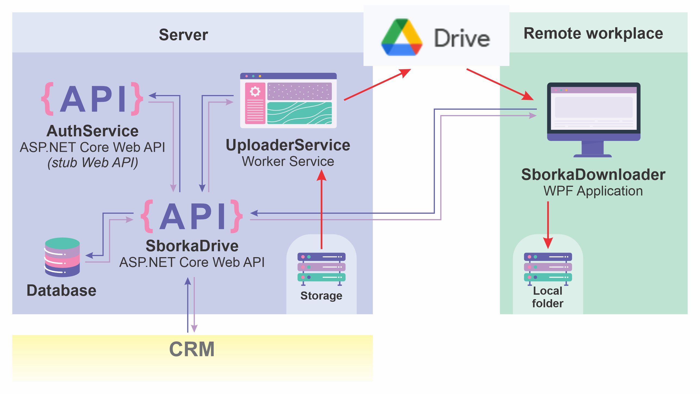
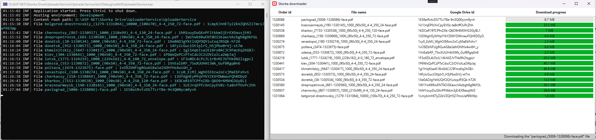
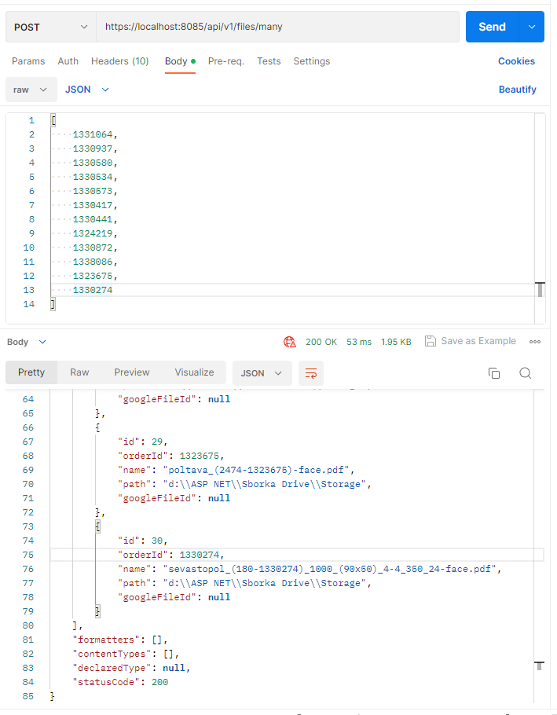

# File sharing subsystem
---
### Microservice architecture

This repository is part of a working production management system at a printing house.

>Background: When the war broke out in Ukraine in 2014, there was a problem with transferring files between cities caused by damaged cables. Often, the network connection speed did not exceed 0.3 MB/s. However, the connection speed with Google servers always remained around 10 MB/s. In this connection, a subsystem was created, consisting of several microservices, which provided automatic file exchange using Google Drive between the main production and remote offices.

This file exchange subsystem consists of:
1) the main Web API, which, upon receiving a request from the CRM, creates a queue of files for download;
2) auxiliary Web API, which manages user authorization. This service is not included in the repository for security reasons, a stub is used;
3) a background service that monitors a queue of files and sends them to Google Drive;
4) a desktop WPF application that uploads files from Google Drive to remote workplaces.

##### Screenshot of the background service and application:

##### Imitation of a request to form a queue of files from CRM.
